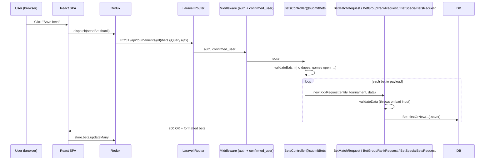

# Architecture

## Elevator Pitch

LigaBet is a Hebrew/RTL soccer-prediction tournament platform. Users create a tournament around a competition (FIFA World Cup, UCL), invite friends via a join code, predict game scores, group standings, and "special questions" (winner, runner-up, top scorer, top assists, MVP, offensive team), and accumulate points on per-game leaderboard snapshots. Tournament admins configure the per-tournament scoring rules before the competition starts; the LigaBet super-admin manages competitions, completes matches, and triggers special-bet scoring.

## High-Level Shape

```mermaid
flowchart LR
    Browser -->|HTTPS| Apache
    Apache -->|public/index.php| Laravel
    Laravel -->|"/api/*"| Controllers
    Laravel -->|Route::fallback| BladeIndex[react-app.index.blade.php]
    BladeIndex -->|"<script src=js/react-app/appMain.js">"| ReactSPA
    ReactSPA -->|"jQuery.ajax /api/*"| Controllers
    Controllers --> Models[Eloquent Models]
    Controllers --> Actions[app/Actions/*]
    Models --> DB[(MySQL)]
    Actions --> DB
    Actions -->|Football-Data.org| ExternalAPI[(Football-Data API)]
    Controllers -->|FCM push| FCM[Firebase Cloud Messaging]
    Laravel -->|SMTP| Mail[(SendinBlue)]
```

Single web process (Heroku Apache + PHP). No queue workers, no cron — everything happens in-request or via manual admin endpoints. The console command `UpdateOngoingCompetitions` exists for pulling fixture/result data but is not scheduled by default (`app/Console/Kernel.php` has an empty `schedule()`).

## Two Halves, One Repo

- **Backend** — Laravel 8 (PHP) in `app/`, `routes/`, `database/`, `config/`. Serves the REST API under `/api/*` and admin endpoints under `/admin/*`.
- **Frontend** — React 17 + Redux Toolkit + TypeScript in `frontend/src/`. Built by Webpack to `public/js/react-app/appMain.js`. Served by the Laravel fallback route via a Blade template.

The two halves communicate via:
- `/api/*` routes (defined in `routes/web.php`, not `routes/api.php`, despite the prefix)
- The `react-app.index` Blade view, which injects server-side user data and the CSRF token into a global the SPA reads on boot.

## Request Lifecycle — A Bet Submission



`Bet.score` is left `null` on submission — scoring happens later when a game is marked complete (see `LEADERBOARD_FLOW.md`).

## Code Boundaries

| Area | Where |
|------|-------|
| Routes | `routes/web.php` (everything), `routes/api.php` (one trivial route only) |
| HTTP controllers | `app/Http/Controllers/*` |
| Middleware (auth + role gates) | `app/Http/Middleware/*` |
| Eloquent models | `app/*.php` at root, plus `app/SpecialBets/SpecialBet.php` |
| Bet engine (validation + scoring) | `app/Bets/*` |
| Single-purpose orchestration | `app/Actions/*` (15 actions) |
| External-API fetching | `app/DataCrawler/*` |
| Notifications | `app/Notifications/SendCloseCallsMatchBetsNotifications.php` |
| Console commands | `app/Console/Commands/*` (e.g. `UpdateOngoingCompetitions`) |
| Enums | `app/Enums/*` (`BetTypes`, `GameSubTypes`, plus a shared `AbstractEnum` base) |
| Config | `config/*.php` (especially `defaultScore.php`, `bets.php`, `api.php`) |
| Migrations | `database/migrations/*` (38 files) |
| Blade views (SPA shell + auth pages) | `resources/views/*` |
| SPA entry | `frontend/src/index.tsx` |
| SPA app shell | `frontend/src/App.tsx → AppMain.tsx → AppBody.tsx → AppContent.tsx → AppBasicRoutes.tsx` |
| Redux store | `frontend/src/_helpers/store.ts`, slices under `_reducers/`, selectors under `_selectors/` |
| Frontend API client | `frontend/src/api/common/apiRequest.ts` (jQuery.ajax wrapper) and domain modules under `frontend/src/api/` |
| TypeScript types | `frontend/src/types/*` |
| Webpack (active) | `frontend/webpack.config.js` → `public/js/react-app/appMain.js` |
| Laravel Mix (legacy, likely dead) | `webpack.mix.js` → `public/js/app.js`, `public/css/app.css` |

## Hybrid Serving Model

`routes/web.php:151-153`:

```php
Route::fallback(function () {
    return view('react-app.index');
})->middleware("auth");
```

Every non-API request that doesn't match an earlier route falls through to the React SPA — but only if the user is authenticated. Unauthenticated requests redirect to Laravel's built-in login (`Auth::routes()` at line 42). This is how SPA deep links (`/leaderboard`, `/my-bets`, `/his-bets/123`) work without configuring nginx/Apache rewrites.

`/api/*` routes are defined explicitly in the same file and never hit the fallback. The `routes/api.php` file is essentially unused (one trivial `/api/user` endpoint).

## What's Not Here

- **No queue workers** — `QUEUE_DRIVER=sync` in `.env.example`. Every `dispatch()` runs in-request.
- **No cron / scheduled jobs** — `Kernel.php@schedule` is empty; data sync happens on demand via admin endpoints.
- **No CI/CD** — no `.github/`, `.gitlab-ci.yml`, or similar.
- **No automated tests of substance** — `tests/Feature/` and `tests/Unit/` are scaffolding (`ExampleTest`, `GroupStageDoneTest`).
- **No WebSockets** — the live leaderboard uses polling via `useLiveUpdate` hook on the frontend.
- **No queue/events for inter-action chaining** — `UpdateGameBets`, `UpdateLeaderboards`, `CalculateSpecialBets` are wired together by the admin endpoint that triggers them, not by Laravel events.

See `GOTCHAS.md` for the implications.
