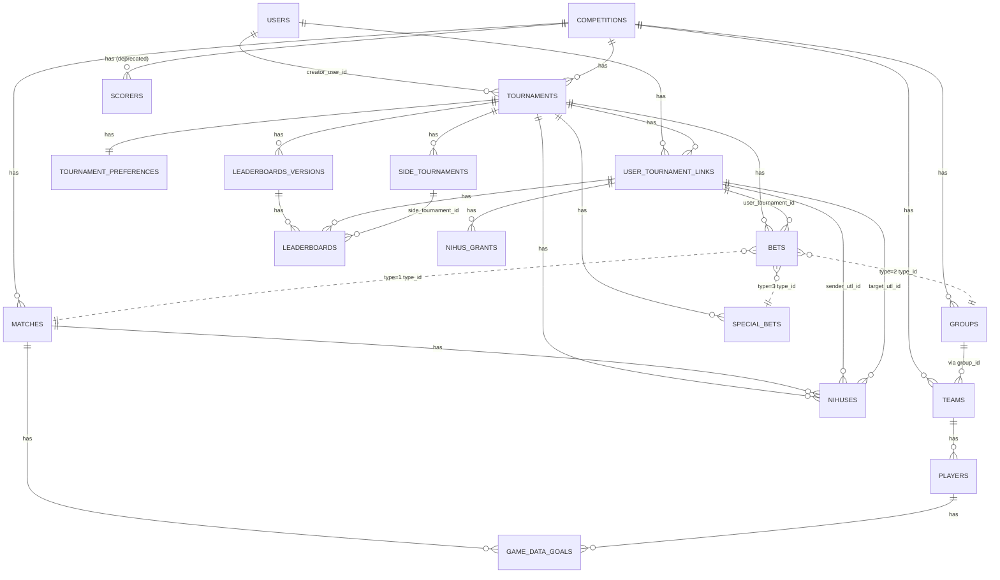

# Database Schema

Authoritative reference for the schema. Generated from `database/migrations/*` (38 files, 2014–2024). Source of truth: the migrations themselves — if something here disagrees with the migrations, the migrations win.

## Quick Map



## Tables by Domain

### Auth / Users

#### `users`
Original schema (2014) had `name` + `username`. Now uses `email` as the identity (migration `2022_10_29_102957_user_email.php` dropped name/username and added unique email).

| Column | Type | Notes |
|---|---|---|
| `id` | unsignedInt PK auto | |
| `email` | string, unique | replaced `username` (2022-10-29) |
| `password` | string | bcrypt |
| `permissions` | int | `User::TYPE_*`: 2=admin, 1=tournament-admin, 0=user, -1=monkey |
| `can_edit_score_config` | bool, default false | added 2022-10-24 |
| `fcm_token` | string, nullable | added 2021-06-25 |
| `remember_token` | string, nullable | Laravel default |
| `created_at`, `updated_at` | timestamps | |

#### `password_reset_tokens`
| Column | Type | Notes |
|---|---|---|
| `email` | string, indexed, unique | PK-like |
| `token` | string | |
| `created_at` | timestamp | |

#### `email_of_unregistered_tournament_admin`
Pre-registers emails that get auto-promoted to `TYPE_TOURNAMENT_ADMIN` when they sign up.

| Column | Type | Notes |
|---|---|---|
| `email` | string, indexed, unique | |
| `created_at` | timestamp | |

### Competition Data

#### `competitions`
| Column | Type | Notes |
|---|---|---|
| `id` | unsignedBigInt PK | |
| `type` | string | `Competition::TYPE_WC` or `TYPE_UCL` |
| `name` | string | |
| `last_registration` | timestamp, nullable | |
| `start_time` | timestamp, nullable | |
| `config` | json | API endpoints / connections |
| `status` | string | added 2023-09-06. `STATUS_INITIAL/ONGOING/DONE` |
| `emblem` | string, nullable | added 2023-09-06, made nullable 2023-09-07 |
| `created_at`, `updated_at` | timestamps | |

#### `groups`
| Column | Type | Notes |
|---|---|---|
| `id` | unsignedInt PK | |
| `external_id` | string | upstream API ID |
| `name` | string | e.g. "Group A" |
| `standings` | json, nullable | cached final standings (array of team_ids in order) |
| `competition_id` | foreignId | added 2022-07-09 |
| `created_at`, `updated_at` | timestamps | |

#### `teams`
| Column | Type | Notes |
|---|---|---|
| `id` | unsignedInt PK | |
| `external_id` | string, nullable | |
| `name` | string | |
| `crest_url` | string | team logo URL |
| `group_id` | string (NOT FK, was changed to int then back to string for PostgreSQL — see 2022-07-31) | |
| `competition_id` | foreignId | added 2022-07-09 |
| `created_at`, `updated_at` | timestamps | |

#### `players`
| Column | Type | Notes |
|---|---|---|
| `id` | unsignedBigInt PK | |
| `external_id` | string | |
| `name` | string | |
| `team_id` | foreignId | |
| `shirt` | int, nullable | jersey number |
| `position` | string, nullable | |
| `goals` | int, **indexed** | seasonal goals |
| `assists` | int, **indexed** | seasonal assists |
| `created_at`, `updated_at` | timestamps | |

#### `matches` (model: `Game`)
| Column | Type | Notes |
|---|---|---|
| `id` | unsignedInt PK | |
| `external_id` | string, nullable | |
| `type` | string | `Game::TYPE_GROUP_STAGE` or `TYPE_KNOCKOUT` |
| `sub_type` | string | `GameSubTypes::FINAL/THIRD_PLACE/SEMI_FINALS/QUARTER_FINALS/LAST_16/LAST_32` |
| `team_home_id` | int | FK to `teams.id` (no DB constraint) |
| `team_away_id` | int | FK to `teams.id` |
| `start_time` | int, nullable | unix timestamp |
| `result_home` | int, nullable | 90-minute score |
| `result_away` | int, nullable | |
| `score` | int, nullable | legacy aggregate |
| `ko_winner` | int, nullable | winning team_id for knockout |
| `competition_id` | foreignId | added 2022-07-09 |
| `is_done` | bool, default false | added 2022-11-19 |
| `full_result_home` | int, nullable | added 2022-11-29 (extra time / aggregate) |
| `full_result_away` | int, nullable | added 2022-11-29 |
| `done_time` | int, nullable | added 2023-09-21 |
| `ko_leg` | string, nullable | added 2023-12-09. `Game::LEG_TYPE_FIRST` or `LEG_TYPE_SECOND` |
| `created_at`, `updated_at` | timestamps | |

#### `scorers` — DEPRECATED
Superseded by `players` + `game_data_goals`. Kept around because old admin code still touches it.

| Column | Type | Notes |
|---|---|---|
| `id` | unsignedInt PK | |
| `external_id` | string, unique | |
| `name` | string, unique | |
| `team_id` | string | |
| `goals` | int | |
| `competition_id` | foreignId | added 2022-07-09 |
| `created_at`, `updated_at` | timestamps | |

#### `game_data_goals`
Per-game per-player goal/assist log. Powers live top-scorer/assists calculation.

| Column | Type | Notes |
|---|---|---|
| `id` | unsignedBigInt PK | |
| `game_id` | int | FK to `matches.id` (no DB constraint) |
| `player_id` | int | FK to `players.id` (no DB constraint) |
| `goals` | int, default 0 | |
| `assists` | int, default 0 | |
| `created_at`, `updated_at` | timestamps | |

### Tournaments

#### `tournaments`
| Column | Type | Notes |
|---|---|---|
| `id` | unsignedBigInt PK | |
| `competition_id` | foreignId | |
| `name` | string | was unique 2022-10-29, then made non-unique 2022-11-16 |
| `config` | json | scoring rules, prizes, special-question flags, side-tournament games |
| `status` | string | `STATUS_INITIAL/ONGOING/DONE` |
| `creator_user_id` | foreignId | added 2022-08-20 |
| `code` | string, unique | join code, added 2022-08-20 |
| `created_at`, `updated_at` | timestamps | |

#### `user_tournament_links` (model: `TournamentUser`, aka UTL)
**The most important join table in the system.** One row per (user, tournament).

| Column | Type | Notes |
|---|---|---|
| `id` | unsignedBigInt PK | |
| `user_id` | foreignId | |
| `tournament_id` | foreignId | |
| `role` | string | `TournamentUser::ROLE_*`: admin/manager/contestant/not_confirmed/rejected/monkey |
| `name` | string | display name within this tournament, added 2022-08-14 |
| `created_at`, `updated_at` | timestamps | |

No DB-level uniqueness on `(user_id, tournament_id)` — enforced in application code.

#### `tournament_preferences`
| Column | Type | Notes |
|---|---|---|
| `id` | unsignedBigInt PK | |
| `tournament_id` | foreignId, **unique** | |
| `auto_approve_users` | bool, default true | |
| `use_default_config_answered` | bool, default false | |
| `created_at`, `updated_at` | timestamps | |

### Betting

#### `bets`
Originally pointed at `users.id` directly. The 2022 tournaments refactor dropped `user_id` and added `tournament_id` + `user_tournament_id`.

| Column | Type | Notes |
|---|---|---|
| `id` | unsignedInt PK | |
| `type` | int | `BetTypes::Game=1`, `GroupsRank=2`, `SpecialBet=3` |
| `type_id` | int | FK to one of: `matches.id`, `groups.id`, `special_bets.id` depending on `type` |
| `data` | text | JSON; shape depends on `type` (see BET_SCORING.md) |
| `score` | int, nullable | null until scored |
| `tournament_id` | foreignId | added 2022-07-09 |
| `user_tournament_id` | foreignId | added 2022-07-09 (replaced `user_id`) |
| `created_at`, `updated_at` | timestamps | |

#### `special_bets`
One row per special question per tournament.

| Column | Type | Notes |
|---|---|---|
| `id` | unsignedBigInt PK | |
| `tournament_id` | foreignId | |
| `type` | string | `SpecialBet::TYPE_*`: winner/runner_up/top_scorer/most_assists/mvp/offensive_team/defensive_team |
| `title` | string | user-facing question text |
| `answer` | string, nullable | correct answer; for team/player questions can be a comma-separated list for ties |
| `created_at`, `updated_at` | timestamps | |

### Leaderboards

#### `leaderboards_versions`
| Column | Type | Notes |
|---|---|---|
| `id` | unsignedBigInt PK | |
| `tournament_id` | foreignId | |
| `description` | string, was required, **made nullable 2023-05-18** | |
| `game_id` | int, nullable | added 2022-11-18 |
| `created_at`, `updated_at` | timestamps | |
| **UNIQUE** | `(game_id, tournament_id)` as `one_version_per_game` | added 2023-05-18 |

#### `leaderboards`
| Column | Type | Notes |
|---|---|---|
| `id` | unsignedBigInt PK | |
| `user_tournament_id` | foreignId | |
| `tournament_id` | foreignId | |
| `version_id` | foreignId | FK to `leaderboards_versions.id` |
| `rank` | unsignedInt | |
| `score` | unsignedInt | total cumulative score as of this version |
| `bet_score_override` | json | added 2023-06-05. Non-game-bet scores accumulated up to this game |
| `side_tournament_id` | foreignId, nullable | added 2023-10-20 |
| `created_at`, `updated_at` | timestamps | |
| **INDEX** | `(version_id, side_tournament_id)` as `side_tournament_index` | added 2023-10-20 |

### Side Tournaments

#### `side_tournaments`
| Column | Type | Notes |
|---|---|---|
| `id` | unsignedBigInt PK | |
| `tournament_id` | foreignId | |
| `name` | string | |
| `emblem` | string, nullable | |
| `config` | json, nullable | added 2023-11-28. Holds `competingUtls` array |
| `created_at`, `updated_at` | timestamps | |

### Social (Nihusim)

#### `nihuses` (model: `Nihus`)
| Column | Type | Notes |
|---|---|---|
| `id` | unsignedBigInt PK | |
| `tournament_id` | foreignId | |
| `game_id` | foreignId | |
| `home_score` | int | context score the nihus was sent with |
| `away_score` | int | |
| `sender_utl_id` | foreignId | UTL of sender |
| `target_utl_id` | foreignId | UTL of target |
| `text` | string | |
| `gif` | string | URL |
| `seen` | bool, default false | |
| `created_at`, `updated_at` | timestamps | |

#### `nihus_grants`
| Column | Type | Notes |
|---|---|---|
| `id` | unsignedBigInt PK | |
| `user_tournament_id` | foreignId | |
| `amount` | int | |
| `grant_reason` | string | |
| `seen` | bool, default false | |
| `created_at`, `updated_at` | timestamps | |

### Legacy

#### `ranks` — DEPRECATED
Monolithic JSON store of historic rankings. Pre-dates `leaderboards_versions`. Still updated by `AdminController::createNewRankingRow/updateLastRankingRow/removeLastRankingRow` but reads should go through `leaderboards_versions`.

| Column | Type | Notes |
|---|---|---|
| `id` | unsignedInt PK | |
| `data` | longText | JSON blob |
| `created_at`, `updated_at` | timestamps | |

## Schema-Evolution Timeline

| Year/Quarter | Major changes |
|---|---|
| 2014 | `users` (with `username`) |
| 2018 Q2 | `matches`, `bets` (pointed at `user_id`), `teams` |
| 2021 Q2 | `scorers`, `groups`, FCM token on `users` |
| 2021 Q3 | `ranks` (legacy ranking store) |
| **2022 Q3 (the big one)** | `competitions`, `tournaments`, `user_tournament_links` (UTL), `leaderboards` + `leaderboards_versions`, `special_bets`, `players`. `bets.user_id` dropped → `tournament_id` + `user_tournament_id` added. UTL gets `name`. Tournament gets `creator_user_id` + `code` |
| 2022 Q4 | `password_reset_tokens`, `email_of_unregistered_tournament_admin`, `tournament_preferences`. Users switch from `username` to `email`. Tournament name uniqueness toggled (added, then removed). `leaderboards_versions` gets `game_id`. `matches` gets `is_done`, `full_result_home/away`. `game_data_goals` introduced. `users` gets `can_edit_score_config` |
| 2023 | `competitions` gets `status` + `emblem` (later made nullable). `matches` gets `done_time` and `ko_leg` (two-legged ties). `leaderboards_versions` unique on `(game_id, tournament_id)`. `leaderboards.bet_score_override` (JSON). `side_tournaments` table + `leaderboards.side_tournament_id` + index. `side_tournaments.config` |
| 2024 Q1 | `nihuses` + `nihus_grants` (social/teasing feature) |

## Foreign-Key Caveats

Most "FK" columns are declared as `foreignId(...)` (Laravel naming convention, suggests an `unsigned bigint`) **without** an actual DB-level foreign key constraint. So:

- Deletions don't cascade automatically.
- Orphan rows are possible if application code doesn't clean up.
- Code paths that "delete a user" or "delete a match" must hunt down dependent rows themselves (see `AdminController::deleteUser`, `deleteMatch`).

The few real DB constraints worth knowing:
- `password_reset_tokens.email` — unique
- `email_of_unregistered_tournament_admin.email` — unique
- `users.email` — unique
- `tournaments.code` — unique
- `tournament_preferences.tournament_id` — unique
- `leaderboards_versions.(game_id, tournament_id)` — unique

## Where to Look for Schema Changes

```
git log database/migrations/
ls database/migrations/    # chronological
```

When adding migrations, see RECIPES.md (`How to add a new migration`).
