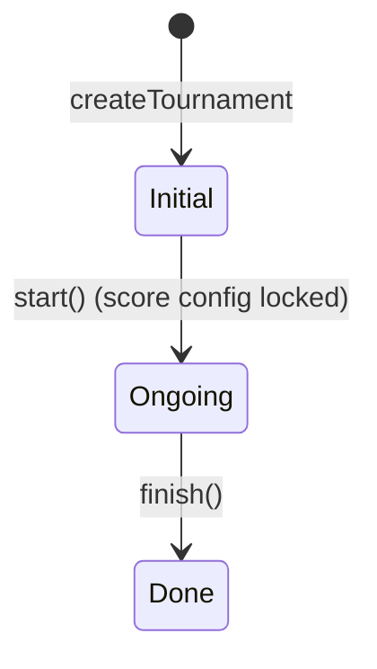
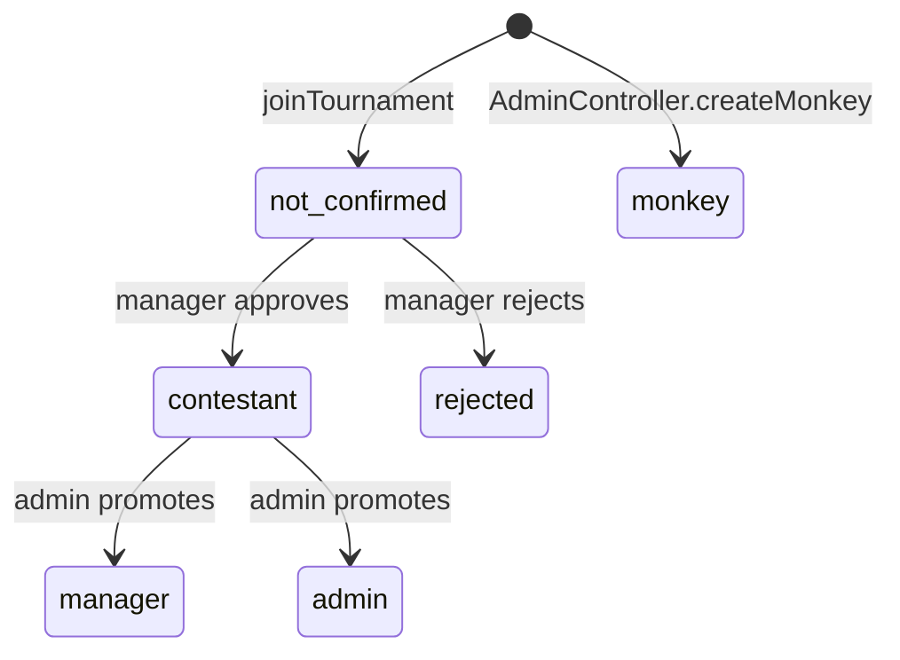

# Domain Model

A glossary of every concept used in the codebase. Read this **first** if you're new — most code makes sense once these terms are anchored.

## Core Entities

### Competition (`app/Competition.php`)
A real-world football tournament — e.g. World Cup 2022 or a UEFA Champions League season. Owns all the static-ish data: `groups`, `teams`, `players`, `games`. One Competition powers many user-facing Tournaments.

- **Types** (`Competition::TYPE_WC`, `TYPE_UCL`) — World Cup or UEFA Champions League.
- **Lifecycle**: `STATUS_INITIAL → STATUS_ONGOING → STATUS_DONE`.
- `isClubsCompetition()` returns true for UCL (some game logic is club-specific).
- `getCrawler()` returns the right `DataCrawler` for syncing fixtures and results from Football-Data.org (`app/DataCrawler/*`).

### Tournament (`app/Tournament.php`)
A private prediction game — a group of friends predicting one Competition. Has its own scoring rules, prizes, special-question config, leaderboard.

- **Lifecycle**: `STATUS_INITIAL → STATUS_ONGOING → STATUS_DONE`. `start()` flips to ongoing, deletes deprecated special-question bets, and validates the score config; `finish()` flips to done.
- **Join code** — short alphanumeric `code` on the `tournaments` table. Friends join by code via `UserController@joinTournament`.
- **`config` JSON** — `scores.*` (see BET_SCORING.md), `prizes` (array of strings), `sideTournamentGames`, plus runtime flags (`specialQuestionFlags`).
- **Editable only while `initial`** — see GOTCHAS.md.

### User (`app/User.php`)
A real human (or a "monkey"). Has `permissions` (the site-wide role) and zero or more UTLs (one per tournament they joined).

- **Permissions** (`User::TYPE_*`):
  - `TYPE_ADMIN = 2` — full site admin
  - `TYPE_TOURNAMENT_ADMIN = 1` — can create tournaments
  - `TYPE_USER = 0` — default
  - `TYPE_MONKEY = -1` — non-human auto-better
- `hasTournamentAdminPermissions()` returns true for both admin and tournament-admin.
- `canJoinAnotherTournament(competitionId)` caps users at **3 tournaments per competition**.

### TournamentUser (UTL) (`app/TournamentUser.php`, table `user_tournament_links`)
**The most important relationship in the system.** A single user's participation in a single tournament — a junction row that owns the user's role-within-this-tournament, their display name, and their bets.

Why it exists: before the 2022 tournaments refactor, `bets` pointed at `users` directly. Now `bets.user_tournament_id` points at a UTL, so one user can compete in many tournaments without bet collisions.

- **Roles** (`TournamentUser::ROLE_*`, with a numeric permission ladder):
  | Role | `permissions()` | Meaning |
  |------|-----------------|---------|
  | `admin` | 3 | Tournament owner / full control |
  | `manager` | 2 | Can manage other UTLs |
  | `contestant` | 1 | Regular participant, can bet |
  | `not_confirmed` | 0 | Joined but not yet approved |
  | `rejected` | -1 | Denied entry |
  | `monkey` | -2 | Auto-bet bot |
- `isConfirmed()` — role permission > `not_confirmed` (so anyone admin/manager/contestant)
- `isCompeting()` — confirmed OR monkey (anyone whose bets affect leaderboards)
- `isRegistered()` — role permission >= `not_confirmed` (excludes rejected/monkey)
- `hasManagerPermissions()` — admin or manager

### Bet (`app/Bet.php`)
A single prediction. Polymorphic via `type` + `type_id`:

| `type` (`BetTypes::*`) | `type_id` references | Predicts |
|------------------------|----------------------|----------|
| `Game = 1` | `matches.id` | Score of a match (+ optional knockout qualifier) |
| `GroupsRank = 2` | `groups.id` | Final standings of a group (1–4) |
| `SpecialBet = 3` | `special_bets.id` | Answer to a special question |

- `data` is a JSON blob — shape depends on type, see BET_SCORING.md.
- `score` is `null` until the bet's outcome is determined (game completes, group ranks calculated, MVP announced, etc.).
- `user_tournament_id` points at the UTL, **never directly at a user**.

### Game (`app/Game.php`, table `matches`)
A single match. Group stage or knockout.

- **Type** (`Game::TYPE_GROUP_STAGE`, `TYPE_KNOCKOUT`).
- **`sub_type`** for knockout (`GameSubTypes`): `FINAL`, `THIRD_PLACE`, `SEMI_FINALS`, `QUARTER_FINALS`, `LAST_16`, `LAST_32`.
- **Two-legged ties** (UCL): `ko_leg = 'first' | 'second'`. `isTwoLeggedTie()`, `isFirstLeg()`, `isLastLeg()`, `getOtherLegGame()`.
- `result_home` / `result_away` are the 90-minute score. `full_result_home/away` is the extra-time aggregate. `ko_winner` is the team ID that advanced.
- `is_done` flips true when a result is set; `done_time` records when.
- `isOpenForBets()` — game is in the future and `is_done == false`, minus an optional pre-game lock window (`config('bets.lockBeforeSeconds')`).
- `isTheLastGameOnGroup()` — used to trigger group-rank scoring.

### Group (`app/Group.php`)
A group-stage pool of 4 teams (Group A/B/C/D…).

- `getStandings()` returns the ordered team IDs after all group games are done.
- `calculateBets()` recomputes all `GroupsRank` bets when standings change.

### SpecialBet (`app/SpecialBets/SpecialBet.php`)
A "special question" tied to a tournament — e.g. "Who wins the tournament?" or "Who is top scorer?". One row per question per tournament.

- **Types** (`SpecialBet::TYPE_*`):
  - `WINNER`, `RUNNER_UP` (a team ID)
  - `TOP_SCORER`, `MOST_ASSISTS`, `MVP` (a player ID)
  - `OFFENSIVE_TEAM` (group-stage team with most goals — a team ID)
  - `DEFENSIVE_TEAM` (a team ID; **partial implementation** — scoring code exists in `BetSpecialBetsRequest` but `config/defaultScore.php` has no `defensiveTeam` key and `specialQuestionFlags` has no `defensiveTeam` flag).
- `answer` — the correct answer once known. For Winner/Runner-Up/Offensive/Defensive: can be a single team ID or comma-separated (ties).
- `isOn()` — true if `tournament.config.scores.specialQuestionFlags.{type}` is true.
- `calculateBets()` rescores all bets of this special-bet type.

### Leaderboard + LeaderboardsVersion (`app/Leaderboard.php`, `app/LeaderboardsVersion.php`)
Per-game snapshots of who's winning the tournament.

- **`LeaderboardsVersion`** — one row per `(tournament_id, game_id)`. Created when a game is marked done.
- **`Leaderboard`** — one row per UTL per version. Holds `rank`, `score`, and `bet_score_override` (a JSON blob with non-game-bet scores rolled up to this game).
- **Side tournaments** add parallel `Leaderboard` rows under `side_tournament_id`.

See LEADERBOARD_FLOW.md for the full mechanism.

### SideTournament (`app/SideTournament.php`)
A sub-tournament inside a parent tournament — a filtered leaderboard for a subset of UTLs.

- `config.competingUtls` — array of UTL IDs eligible for this side leaderboard.
- `tournament.config.sideTournamentGames[gameId]` — which side tournaments are scored as of which game (controls when each side's leaderboard updates).

### Nihus + NihusGrant (`app/Nihus.php`, `app/NihusGrant.php`)
Social trash-talk feature. "Nihus" = Hebrew for "consolation"/teasing message.

- **`NihusGrant`** — admin grants a UTL N "nihusim" they can send.
- **`Nihus`** — a single sent message (text + GIF + match context: `home_score`, `away_score`). Has `sender_utl_id`, `target_utl_id`, `game_id`.
- Availability = `sum(grants) - count(sent)`. See `TournamentUser::getAvailabileNihusim()`.

### Ranks (`app/Ranks.php`) — LEGACY
A monolithic JSON blob of cumulative ranking data. Predates `LeaderboardsVersion`. Still updated by admin endpoints (`createNewRankingRow`, `updateLastRankingRow`, `removeLastRankingRow`) but most reads go through `LeaderboardsVersion`. **Don't build new features on top of `Ranks`.**

### TournamentPreferences (`app/TournamentPreferences.php`)
One row per tournament. Two booleans:
- `auto_approve_users` — new UTLs are auto-confirmed (skip `not_confirmed` state).
- `use_default_config_answered` — flag for the wizard that asked the creator whether to use the default score config.

### Other Models
- **Team / Player / Scorer** — competition data. `scorers` is **deprecated** in favor of `game_data_goals` + `players.goals/assists`.
- **GameDataGoal** — per-game per-player goal/assist count. Set via `AdminController@setGameGoalsData`.
- **Competition** has-many-through Player via Team, and has-many-through GameDataGoal via Game (for aggregated stats).
- **PasswordResetToken** — Laravel default, just custom email-keyed table.
- **InvitaionsForTournamentAdmin** (sic) — pre-registers emails that get auto-promoted to tournament-admin when they sign up. Backed by table `email_of_unregistered_tournament_admin`.

## Lifecycle Summary

## Key Invariants (don't violate these)

1. **Bets reference UTLs, not Users** — `bets.user_tournament_id`, never `user_id`. If you find code referencing `user_id` on a bet, it's pre-2022 legacy.
2. **Score config can only be edited while tournament is `initial`** — `TournamentController` rejects edits once `ongoing`. See GOTCHAS.md.
3. **One UTL per (user, tournament)** — enforced by application code via `User::getTournamentUser()` and `Tournament::createUTL()`, not by a DB unique constraint.
4. **`LeaderboardsVersion` is unique per `(tournament_id, game_id)`** — DB constraint from migration `2023_05_18_leaderboards_versions_unique_game_id_per_tournament.php`.
5. **`SpecialBet.answer` can be a comma-separated list** — to support ties on top scorer / offensive team / etc.
6. **Two-legged ties bet on the first leg auto-generate the second leg bet** — see `BetsController@submitBets` and GOTCHAS.md.
